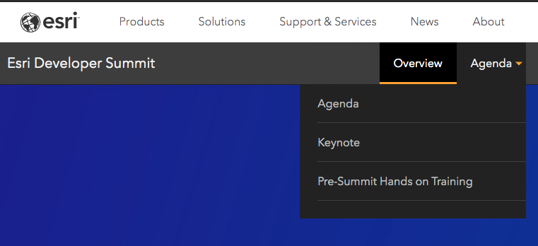
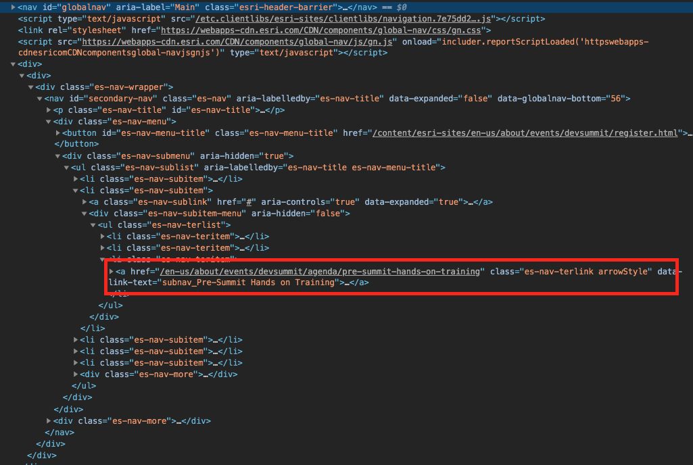
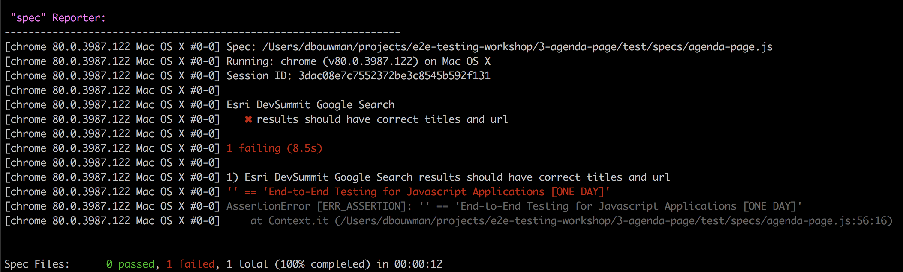
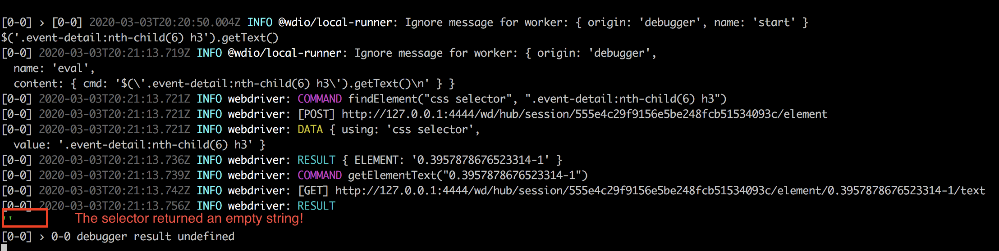
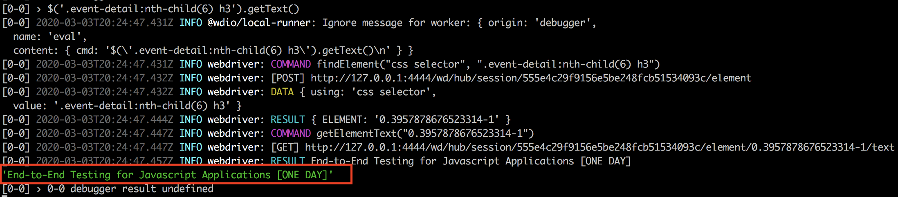

# Testing Navigation

We're going to build on the previous exercise. When we left off, we had loaded the DevSummit event home page. From here, we'll interact with the navigation system to locate the Pre-Conference Workshops page, and navigate there, finally locating the entry for this workshop.

## Setup
[Same Webdriver.IO setup from last exercise](../2-google-test/README.md)
or copy the previous folder to `3-agenda-page`
or just keep working in the previous folder

### Locating the Navigation Elements

The DevSummit homepage has a navigation bar, and we need to locate the `Agenda` entry and click on the `Pre-Summit Hands on Training` link.



Suprisingly, the DOM is somewhat complicated - the link we want to click is shown below.



What's more, that element is not even visible, until we click on the `Agenda` - so this will be a two step process.

1) locate and click the Agenda link
2) locate and click the Workshops link

### Deep Selectors
Given the DOM structure, it's pretty clear that these are going to be messy selectors. If we select the Agenda element in devtools and ask for the selector, we get this

`#secondary-nav > div.es-nav-menu > div > ul > li:nth-child(2) > a`

While that will work, typically we try to use the simplest-selector-that-reliably-works. And it turns out we can slim this down to

`li.es-nav-subitem:nth-child(2) > a`

Which is literally, select the `a` inside the second `li` that has class `es-nav-subitem`.

Next, the workshop link... again the full selector is awful

`#secondary-nav > div.es-nav-menu > div > ul > li:nth-child(2) > div > ul > li:nth-child(3) > a`

and we can slim it up a little to `li.es-nav-subitem:nth-child(2) > div > ul > li:nth-child(3) > a`

Lets add another hash of selectors, specifically for the Agenda site

```js
const AGENDA = {
  AGENDA_DROP_DOWN: 'li.es-nav-subitem:nth-child(2) > a',
  WORKSHOP_LINK: 'li.es-nav-subitem:nth-child(2) > div > ul > li:nth-child(3) > a'
}

// describe(...
```

It should be said that these are very brittle selectors. If the nav was refactored, or moved in the page dom structure, these would likely break.

### Resilient Selectors

If you know your app's ui is undergoing changes, then the most robust solution is to add `data-test="someid"` attibutes into the source code like this

```html
<li class="es-nav-teritem">
  <a data-test="subnav-workshop" href="/en-us/about/events/devsummit/agenda/pre-summit-hands-on-training" class="es-nav-terlink arrowStyle" data-link-text="subnav_Pre-Summit Hands on Training">Pre-Summit Hands on Training</a>
</li>
```

Then you can use a selector like `a[data-test="subnav-workshop"]`, and no matter where the nav is in the page DOM, that link will be found. Unfortunately we can't edit this site, so we have to use the deep selectors.

### Linking to the Workshops Page

Back in our test, we need to click the drop-down to open the sub-nav, then click the link.

We do this with two `.click()` calls, and then we add an assertion that we ended up on the right page

```js
 // click the agenda on nav bar to open it
  $(AGENDA.AGENDA_DROP_DOWN).click();
  // now click the workshop link
  $(AGENDA.WORKSHOP_LINK).click();

  assert.equal(browser.getUrl(), 'https://www.esri.com/en-us/about/events/devsummit/agenda/pre-summit-hands-on-training', 'Dev Summit workshops page');

```

### Locating the Session

Let's open the target page in our browser https://www.esri.com/en-us/about/events/devsummit/agenda/pre-summit-hands-on-training.

When we load up the session page, we see that the designers have gotten creative and the sessions fade in as we scroll down the page. Something tells me this is going to make things interesting.

### Locating the Session

Again, we right click on the "End-to-End Testing..." header in the dom, and inspect it.

Copying the selector gives us `#main-content > div:nth-child(6) > div > div > div.event-detail-registration_heading.lighttheme > h3`

Ouch. That'll work, but we can slim it down a little - we know it's the 6th element with class `.event-detail` so lets add  `.event-detail:nth-child(6) h3` to the `AGENDA` hash.

```js
const AGENDA = {
  AGENDA_DROP_DOWN: 'li.es-nav-subitem:nth-child(2) > a',
  WORKSHOP_LINK: 'li.es-nav-subitem:nth-child(2) > div > ul > li:nth-child(3) > a',
  SESSION_ENTRY_TITLE: '.event-detail:nth-child(6) h3'
}
```

Now let's add an assertion:
```js
assert.equal($(AGENDA.SESSION_ENTRY_TITLE).getText(), 'End-to-End Testing for Javascript Applications [ONE DAY]');
```

And run the tests...

```
npm test
```

And... nope.



So what's wrong? Turns out that "fade-in" effect is messing with us.

Time for more Webdriver magic...

### Scrolling into View

Webdriver has a [`scrollIntoView`](https://webdriver.io/docs/api/element/scrollIntoView.html) method to help with this sort of thing, so let's try that

```js
$(AGENDA.SESSION_ENTRY_TITLE).scrollIntoView();
assert.equal($(AGENDA.SESSION_ENTRY_TITLE).getText(), 'End-to-End Testing for Javascript Applications [ONE DAY]');
```

but... still no dice. Let's figure out how to debug things.

Webdriver has [`browser.debug()`](https://webdriver.io/docs/api/browser/debug.html) which stops the test at that point, and turns the commandline we started the test from into a REPL.


```js
browser.debug(); // will stop the test here, and turn our command line into a REPL
$(AGENDA.SESSION_ENTRY_TITLE).scrollIntoView();
assert.equal($(AGENDA.SESSION_ENTRY_TITLE).getText(), 'End-to-End Testing for Javascript Applications [ONE DAY]');
```

Now, we can try to see what's going on. Run the tests, and when it stops, enter the following in the console:

```js
$('.event-detail:nth-child(6) h3').getText()
```



Weird. Let's scroll down the page and see if the element is in the DOM.

Now try that same command...



Let's exit the REPL by typing `.exit`, and review what we found out...

1) if we try to locate the `.event-detail:nth-child(6) h3` element right when the page loads, it can't be found
1) if we scroll down, we can find it
1) our call to `$(AGENDA.SESSION_ENTRY_TITLE).scrollIntoView();` does not do what we'd hoped

What's happening is that the element we are trying to scroll to, it not visible in the DOM. We have to scroll past it before it's rendered.

Looking in the DOM, we can see there is a `globalfooter`, so let's scroll to that

```js
// scroll to the footer to get everything into the DOM
$('#globalfooter').scrollIntoView();
```

When we run this again, it's STILL not working... and it's because there are staggered fade-in's. Turns out there is a handy helper that we can use to wait for this

```js
// scroll to the footer to get everything into the DOM
$('#globalfooter').scrollIntoView();
$(AGENDA.SESSION_ENTRY_TITLE).waitForClickable({timeout:1000});
```

Huzzah!


## Final Code
```js
const assert = require('assert');

const SELECTORS = {
    SEARCH_BAR: 'input[title="Search"]',
    SEARCH_BUTTON: 'input[value="Google Search"]',
    ORGANIC_LISTING_HEADERS: '#search .g a h3',
    ORGANIC_LISTING_LINKS: '#search .g a',
};

const AGENDA = {
  AGENDA_DROP_DOWN: 'li.es-nav-subitem:nth-child(2) > a',
  WORKSHOP_LINK: 'li.es-nav-subitem:nth-child(2) > div > ul > li:nth-child(3) > a',
  SESSION_ENTRY: '.event-detail:nth-child(6)',
  SESSION_NEXT_ENTRY: '.event-detail:nth-child(7)',
  SESSION_ENTRY_TITLE: '.event-detail:nth-child(6) h3'
}

const KEYS = {
    ENTER: '\uE007'
};

describe('Esri DevSummit Google Search', () => {
  it('results should have correct titles and url', () => {
    const url = 'https://google.com';
    const searchText = 'esri devsummit 2020';

    browser.url(url);

    const searchBarEl = $(SELECTORS.SEARCH_BAR);
    searchBarEl.waitForDisplayed();
    searchBarEl.setValue(searchText);
    browser.keys(KEYS.ENTER); // "Press" enter to search

    const listingHeaderTexts = $$(SELECTORS.ORGANIC_LISTING_HEADERS).map(el => el.getText());

    assert.equal(listingHeaderTexts[0], '2020 Esri Developer Summit: March 10-13 in Palm Springs, CA', 'First listing has correct title');
    assert.equal(listingHeaderTexts[1], 'Agenda | 2020 Esri Developer Summit', 'Second listing has correct title');
    assert.equal(listingHeaderTexts[2], 'Call for Presentations | 2020 DevSummit, Palm Spring ... - Esri', 'Third listing has correct title');

    const firstListingHeaderLink = $(SELECTORS.ORGANIC_LISTING_LINKS);
    firstListingHeaderLink.click();

    assert.equal(browser.getUrl(), 'https://www.esri.com/en-us/about/events/devsummit/overview', 'Dev Summit page');

    // click the agenda on nav bar to open it
    $(AGENDA.AGENDA_DROP_DOWN).click();
    // now click the workshop link
    $(AGENDA.WORKSHOP_LINK).click();

    assert.equal(browser.getUrl(), 'https://www.esri.com/en-us/about/events/devsummit/agenda/pre-summit-hands-on-training', 'Dev Summit workshops page');

    // scroll to the footer to get everything into the DOM
    $('#globalfooter').scrollIntoView();
    $(AGENDA.SESSION_ENTRY_TITLE).waitForClickable({timeout:1000});

    // find the workshop
    assert.equal($(AGENDA.SESSION_ENTRY_TITLE).getText(), 'End-to-End Testing for Javascript Applications [ONE DAY]');
  });
});

```
