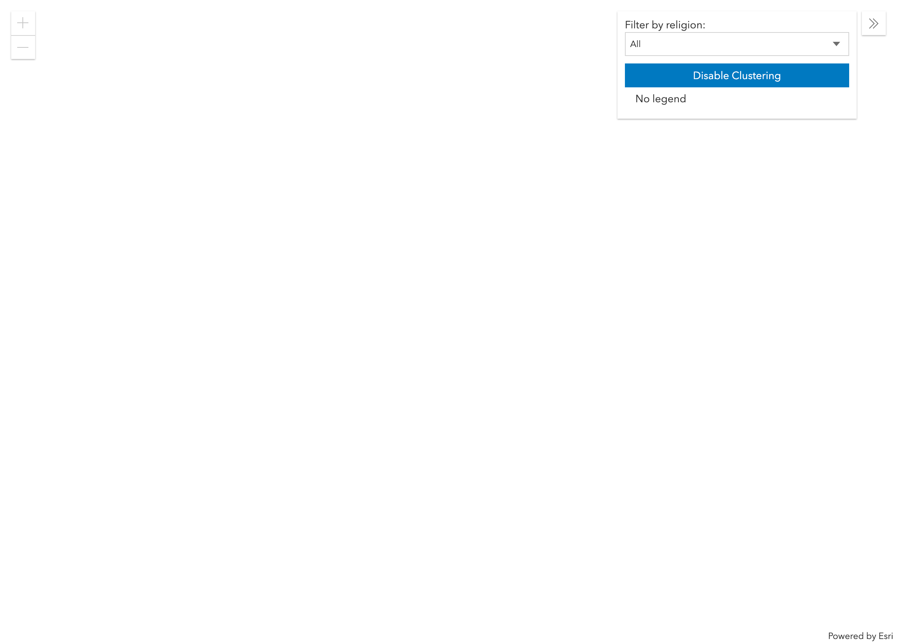
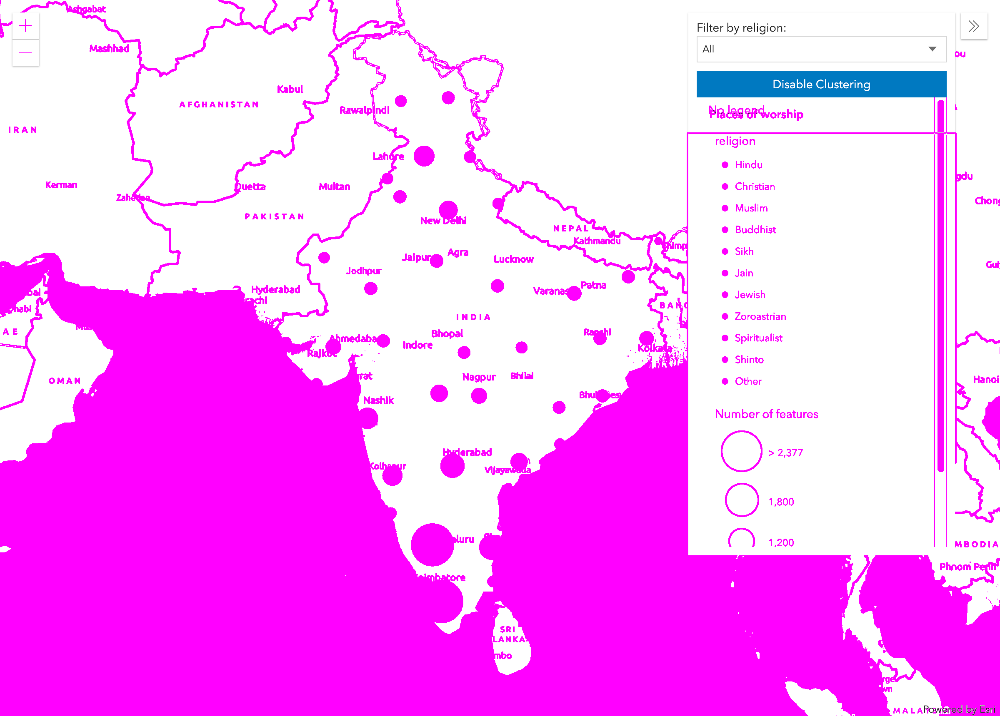

# Testing Maps

## This _is_ Esri, after all.

While the setup we've used to this point is ideal for flexing user interfaces composed of HTML elements, take a look at [this example map app](https://developers.arcgis.com/javascript/latest/sample-code/featurereduction-cluster-filter/live/index.html).

We have some user interface elements in a floating sidebar on the right and the zoom buttons at the top left of the screen. We can find selectors for these elements and, using our new-found testing skills, write tests to click buttons and change the active dropdown menu option.

But what about that map itself? Inspecting it informs us that it's actually a single canvas element upon which the map is being drawn. This makes it very difficult to click specific areas _within_ the map because you can't reference _canvas_ elements with HTML selectors.

A potential solution: *visual testing.*

Visual testing is comparing a screenshot of the current state of the app with one we know is correct. Let's try testing our map with a visual test.

## Setup
We will be starting an entirely new project, so follow [the directions from the first exercise](../1-wdio-starter/README.md) to get set up.

## Create a Spec File
We need somewhere for our test to live, so run the following command in your terminal to create it.

```
$ touch ./test/specs/map-test.js
```

## Set up Visual Testing
WebdriverIO provides visual testing through a service (basically a plugin) called `wdio-image-comparison-service`. It provides access to a couple of lower-level image-comparison libraries. You can read more about it in [this blog post](https://webdriver.io/blog/2019/05/18/visual-regression-for-v5.html).

Let's get it installed and configured.

Run the following command in your terminal.
```
$ npm install --save-dev wdio-image-comparison-service
```

Now, let's register the service in `wdio.conf.js` by adding it with a configuration object to the `services` array. (Notice that we are adding an import for the `join` method at the top of the file.)

```javascript
const { join } = require('path');

// wdio.conf.js
exports.config = {
    // ...
    // =====
    // Setup
    // =====
    services: [
        'selenium-standalone',
        ['image-comparison',
        // The options
        {
            // Some options, see the docs for more
            baselineFolder: join(process.cwd(), './tests/baselineImages/'),
            formatImageName: '{tag}-{width}x{height}',
            screenshotPath: join(process.cwd(), '.tmp/'),
            savePerInstance: true,
            autoSaveBaseline: true,
            blockOutStatusBar: true,
            blockOutToolBar: true,
            // ... more options
        }],
    ],
    // ...
};
```

## Intro to Visual Testing Commands

Now that we have the `wdio-image-comparison-service` installed, a set of special visual testing functions are attached to WebdriverIO's global `browser` object. Check the [docs](https://github.com/wswebcreation/wdio-image-comparison-service/blob/master/docs/OUTPUT.md) for a full list, but here are a few of the most relevant to use today:

### `browser.checkScreen('example-screen-tag', { /* some options */ })`
This method saves a screenshot image of the visible area of the website and checks it against the registered baseline image. The `'example-screen-tag'` string is just a unique identifier that the service uses to know which baseline image to compare against.

### `browser.checkElement(someElement, 'example-element-tag' { /* some options */ })`
This method saves a screenshot image of a particular element (the first parameter is a WebdriverIO element) and checks it against the registered baseline image.

### `browser.checkFullPageScreen('example-full-page-tag', { /* some options */ })`
Saves and checks a screenshot image of an entire page. This differs from `checkScreen` in that it saves a screenshot of the _entire_ page instead of just the currently visible area.

**NOTE:** All of these methods return `0` when there is no difference between the baseline image and the current screenshot.

## Create a Simple Test

Now that we have the visual testing service set up, we can begin creating our visual test. Ultimately, we plan test the full functionality of the mapping [example](https://developers.arcgis.com/javascript/latest/sample-code/featurereduction-cluster-filter/live/index.html) we looked at in the introduction..

Let's add the following boilerplate to `map-test.js`.

```js
const assert = require('assert');

describe('Cluster map', () => {
    it('should look correct on page load', () => {
      const url = 'https://developers.arcgis.com/javascript/latest/sample-code/featurereduction-cluster-filter/live/index.html';
      browser.url(url);
    });
});
```

As we have done in the past, let's add a convenience script for running our tests to `package.json`.
```json
"scripts": {
  "test": "./node_modules/.bin/wdio wdio.conf.js"
}
```

Now, run the test to make sure everything is correctly wired up. We should see the map example from the introduction load into a new browser window (though the window will immediately close so you will only see a flash of the map).
```
$ npm test
```

## Add a Visual Assertion

We have our test running correctly, so now let's add a visual check to our `it` block.

```javascript
it('should look correct on page load', () => {
  const url = 'https://developers.arcgis.com/javascript/latest/sample-code/featurereduction-cluster-filter/live/index.html';
  browser.url(url);

  // NEW... remember, checkScreen returns 0 if it found no difference between the baseline and the current images
  assert.equal(browser.checkScreen('map-screen'), 0);
});
```

And run the tests again.
```
$ npm test
```

Quite a lot should have just happened. For one thing, the map probably stuck around long enough to completely load before the browser closed. That was to give WebdriverIO time to take a good screenshot.

Also, notice that two new directories have been created in your project.

`./.tmp/actual/desktop_chrome` -> This is where our test stores the screenshots it takes in preparation for a comparison. You will see a file in here named `map-screen-SOME_WIDHTxSOME_HEIGHT.png`(with the actual dimensions of the image in place of "SOME_WIDTH" and "SOME_HEIGHT").

`./test/baselineImages` -> This one contains the new baseline image. We have configured our test so that if it doesn't find a baseline image that already exists here, it will assume the current way the app looks should be the baseline and it will simply use the screenshot it just took. In other words, you should see an identical image in here.

Let's open `map-screen-SOME_WIDHTxSOME_HEIGHT.png`.



Uh oh. Looks like our test took a screenshot before the map had fully loaded and the sidebar had been populated with the results of asynchronous network calls.

## Fine-tuning the Baseline Image

### Waiting for Map to Load

The first thing we can do to improve this baseline image is to wait for the page content to load fully before taking the image. Otherwise, our visual testing just won't be accurate.

Add a four-second wait to the test before that visual check.

```javascript
it('should look correct on page load', () => {
  const url = 'https://developers.arcgis.com/javascript/latest/sample-code/featurereduction-cluster-filter/live/index.html';
  browser.url(url);

  browser.pause(4000); // NEW

  assert.equal(browser.checkScreen('map-screen'), 0);
});
```

> WARNING: Using `browser.pause` to add an arbitrary wait made sense for a contrived workshop example, but **it should be avoided in production.** Instead, find ways to make the wait more deterministic. For example, your app could add a tiny, invisible, uniquely-identifiable element somewhere on the page when the map is totally loaded as a signal to your test that it's time to take that screenshot.

Let's run it again (it will fail).
```
$ npm test
```

The test is now failing because it is comparing the now-accurate current screenshot against the faulty baseline image. You can see an image diff in `.tmp/diff/desktop_chrome`.



**To fix this problem**, delete the current baseline image in `test/baselineImages` and run the test again. The updated screenshot will now be used as the baseline and the test will pass.

## Testing Map's Response to Interaction
As the final piece in this tutorial, we will have our test automate a user interaction with the sidebar and verify that the map changes how we expect it to.

Specifically, we'll add a new test to load the page, change the selected religion to "Sikh", and verify that the map looks right.

Under the first `it` block, add another like so:

```javascript
it('Sikh clusters should look correct', () => {
  const url = 'https://developers.arcgis.com/javascript/latest/sample-code/featurereduction-cluster-filter/live/index.html';
  browser.url(url);

  browser.pause(4000); // wait for map to load. DON'T rely on this in production
});
```

Now, we'll add code to select the `Sikh` option from the religions list.

```javascript
const SELECTORS = { // NEW
  SIKH_OPTION: 'option[value="Sikh"]'
};
...
it('Sikh clusters should look correct', () => {
  const url = 'https://developers.arcgis.com/javascript/latest/sample-code/featurereduction-cluster-filter/live/index.html';
  browser.url(url);

  browser.pause(4000); // wait for map to load. DON'T rely on this in production

  $(SELECTORS.SIKH_OPTION).click(); // NEW
});
```

And finally. we'll add a visual assertion, using the string `'map-screen-sikh'` as the key for this unique visual assertion.

```javascript
it('Sikh clusters should look correct', () => {
  const url = 'https://developers.arcgis.com/javascript/latest/sample-code/featurereduction-cluster-filter/live/index.html';
  browser.url(url);

  browser.pause(4000); // wait for map to load. DON'T rely on this in production

  $(SELECTORS.SIKH_OPTION).click(); // NEW
  assert.equal(browser.checkScreen('map-screen-sikh'), 0); // NEW
});
```

Finally, run the tests. We've now verified the map both in its initial state, and after user interaction.

```
$ npm test
```